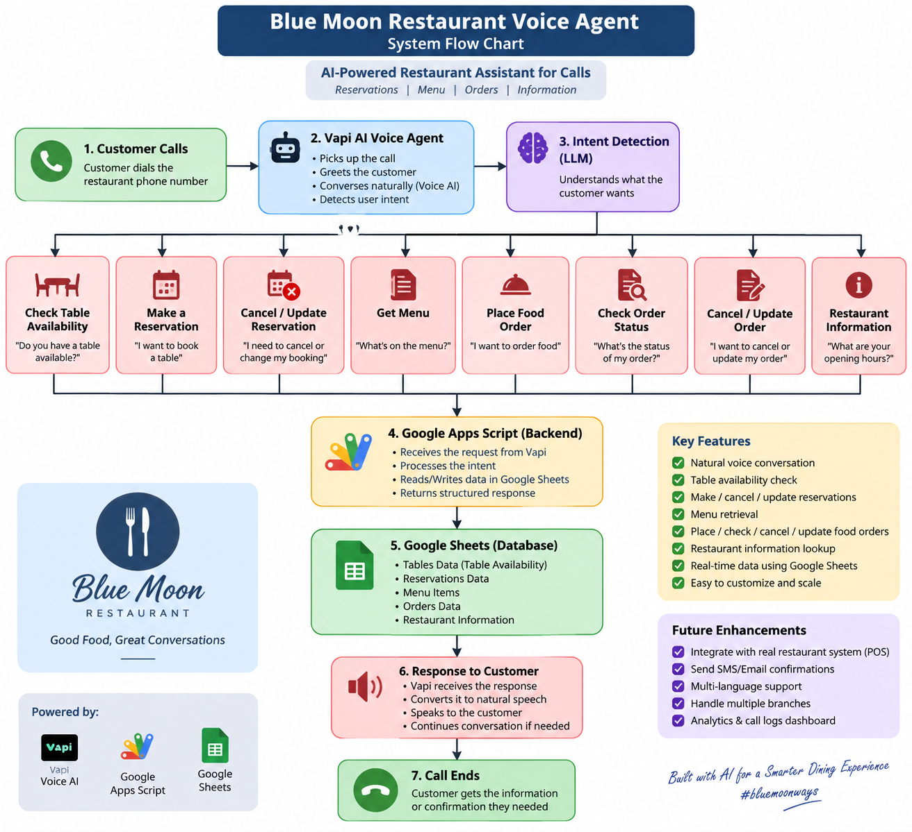

# Blue Moon Restaurant Voice Agent

An AI-powered restaurant voice-agent backend built with **Vapi + Google Apps Script + Google Sheets**.

The project exposes a single Google Apps Script Web App endpoint that receives Vapi tool calls and uses Google Sheets as the restaurant's lightweight database.

## Features

- Table availability lookup by date and time
- Reservation booking with automatic table-count reduction
- Reservation cancellation with table release
- Reservation updates for date, time, and guest count
- Menu lookup with optional category filtering
- Food-order placement with menu-price calculation
- Order status lookup by order ID or customer name
- Order cancellation and item updates
- Restaurant information lookup
- Phone-number preservation in Google Sheets
- Manual test functions for Apps Script
- One Web App URL can serve all Vapi tools

## System Flow Chart



## Tools handled

| Vapi tool | Apps Script function | Purpose |
|---|---|---|
| `Table_Availability` | `checkTableAvailability()` | Check available tables |
| `Reservations` | `bookReservation()` | Create reservation |
| `Orders` | `placeOrder()` | Create food order |
| `Menu` | `getMenu()` | Read menu |
| `Order_Status` | `checkOrderStatus()` | Check order status |
| `Manage_Reservation` | `manageReservation()` | Cancel/update reservation |
| `Manage_Order` | `manageOrder()` | Cancel/update order |
| `Restaurant_Info` | `getRestaurantInfo()` | Return restaurant information |

## Google Sheets structure

The Apps Script expects these sheet tabs:

- `Table_Availability`
- `Reservations`
- `Menu`
- `Orders`
- `Restaurant_Info`

### Required columns

**Table_Availability**
- `date`
- `time`
- `available_tables`

**Reservations**
- `reservation_id`
- `customer_name`
- `phone`
- `date`
- `time`
- `guests`
- `status`

**Menu**
- `item_name`
- `category`
- `price`

**Orders**
- `order_id`
- `customer_name`
- `items`
- `total`
- `status`

**Restaurant_Info**
- `field`
- `value`

## Setup

### 1. Create or open the Google Sheet

Create the five required tabs and add the headers listed above.

### 2. Open Apps Script

In Google Sheets:

`Extensions -> Apps Script`

Paste `Code.gs` into the Apps Script project.

### 3. Add your Sheet ID

Replace:

```javascript
var SHEET_ID = 'YOUR_GOOGLE_SHEET_ID';
```

with your actual Google Sheet ID.

**Do not commit private IDs, API keys, tokens, or credentials to GitHub.**

### 4. Deploy as a Web App

In Apps Script:

`Deploy -> New deployment -> Web app`

Recommended settings for a Vapi webhook:

- Execute as: **Me**
- Who has access: **Anyone**

Authorize the script when Google asks for permission.

### 5. Connect Vapi

Copy the deployed Web App URL ending in `/exec`.

Use that same URL as the Server URL for the Vapi custom tools.

Make sure the tool names/arguments match the functions documented in `Code.gs`.

### 6. Test

The project includes manual test functions:

- `testCheck()`
- `testBook()`
- `testOrder()`
- `testMenu()`
- `testOrderStatus()`
- `testCancelReservation()`
- `testUpdateReservation()`
- `testCancelOrder()`
- `testUpdateOrderItems()`
- `testRestaurantInfo()`

Run them from the Apps Script editor and inspect the execution log.

## Important deployment note

After changing `Code.gs`, create a **new deployment version** or update the existing deployment. Otherwise the Vapi webhook may continue using the previous deployed version.

## Security notes

This repository intentionally contains a placeholder Sheet ID.

For production:

- Keep secrets outside source code.
- Use Apps Script `PropertiesService` for sensitive configuration where appropriate.
- Validate incoming requests before performing write operations.
- Restrict access if your production architecture supports authenticated webhooks.
- Avoid publishing customer phone numbers or other personal data in sample files.

## Example voice-agent flows

### Reservation

```text
Customer: "I want a table tomorrow at 7 PM for four."

Vapi -> Table_Availability
       -> Google Apps Script
       -> Google Sheets

If available:
Vapi -> Reservations
       -> reservation created
       -> available table count decreases
```

### Food order

```text
Customer: "I'd like two Chicken Biryani and one Fresh Lime."

Vapi -> Orders
       -> menu prices are read from Google Sheets
       -> total is calculated
       -> order ID is generated
       -> order is stored in Orders
```

### Cancellation

```text
Customer: "Cancel reservation R001."

Vapi -> Manage_Reservation
       -> reservation status becomes Cancelled
       -> table is released back to availability
```

## Project status

**Portfolio / learning project**

Built to demonstrate practical integration of voice AI, webhooks, Google Apps Script, and spreadsheet-based backend automation.

## Future improvements

- Webhook authentication
- Better request validation
- Concurrent-booking protection with `LockService`
- Separate production configuration from demo data
- Structured JSON tool responses
- Logging and monitoring
- Migration from Google Sheets to a production database
- Payment integration
- SMS/WhatsApp confirmation
- Admin dashboard

## 📌 Portfolio Implementation

This project demonstrates a practical implementation of an **AI-powered e-commerce customer support system** where customers can interact with a business through WhatsApp and receive knowledge-grounded answers automatically.

A sanitized n8n workflow file is included for portfolio demonstration.

👉 [View / Download App Script Code]Code.gs)

For custom implementation or commercial use, please <strong>Contact Us:</strong>
<a href="https://wa.me/923002120566"></a>   <a href="https://www.linkedin.com/in/faheem-abbas-ai-automation-specialist/"></a>

## 👨‍💻 Author

**Faheem Abbas**

AI Automation Specialist | n8n Expert | AI Agents | AI-Powered Business Automation | Lead Generation | API Integrations

**#AI #AIAutomation #n8n #RAG #GoogleGemini #Pinecone #WhatsAppAutomation #LLM #AIEngineering #Automation #bluemoonways**
